# Sucre Turístico

## 1.1 Planteamiento del problema

### Descripción de la problemática

El Golfo de Morrosquillo cuenta con una oferta turística amplia y diversa —playas, gastronomía costeña, alojamientos, experiencias náuticas y eventos culturales— distribuida entre municipios como Tolú, Coveñas y sus corregimientos aledaños. Sin embargo, esta información se encuentra dispersa en redes sociales, páginas no oficiales, recomendaciones informales o simplemente no está disponible en ningún canal digital estructurado.

### Situación actual

Actualmente, un turista que planea visitar el Golfo de Morrosquillo debe recurrir a múltiples fuentes no centralizadas: publicaciones sueltas en Facebook o Instagram, referencias de terceros, agencias informales o búsquedas generales en Google que no siempre arrojan resultados actualizados o confiables. No existe una plataforma oficial que integre en un solo lugar los destinos, alojamientos, restaurantes, experiencias y eventos de la región.

### Necesidad identificada

Se requiere un canal digital centralizado, actualizado y de fácil consulta que permita a los visitantes encontrar información turística confiable del Golfo de Morrosquillo, y que a la vez permita a los administradores mantener esa información organizada y vigente.

### Usuarios afectados

• Turistas y visitantes, que enfrentan dificultades para planear su viaje por falta de información centralizada y confiable.

• Prestadores de servicios turísticos locales (hoteles, restaurantes, operadores de experiencias), cuya oferta queda poco visible al no contar con un canal oficial de promoción.

• Entes u organizaciones encargadas de promover el turismo en la región, que no cuentan con una herramienta tecnológica para gestionar y difundir la información.

### Contextualización de la solución tecnológica

Frente a esta situación, se propone el desarrollo de Sucre Turístico, una plataforma web Full Stack que centralice la consulta y gestión de la información turística del Golfo de Morrosquillo, mediante una arquitectura basada en microservicios que garantice escalabilidad, organización modular del sistema y separación clara de responsabilidades entre los distintos componentes (destinos, alojamientos, gastronomía, experiencias y eventos).

### Formulación del problema

**¿Cómo desarrollar una plataforma web que permita centralizar, consultar y gestionar información turística del Golfo de Morrosquillo, facilitando el acceso de los visitantes a destinos, alojamientos, gastronomía, experiencias y eventos?**

---

## 1.2 Justificación

### 1.2.1 Necesidad del proyecto

El desarrollo de **Sucre Turístico** busca facilitar el acceso a información relacionada con la oferta turística del Golfo de Morrosquillo mediante una plataforma web centralizada, dado que actualmente esta información se encuentra dispersa entre redes sociales, páginas no oficiales y recomendaciones informales, sin un canal único que la organice y la mantenga actualizada.

Esta situación dificulta que los turistas encuentren información confiable al momento de planear su visita, y limita la visibilidad de los prestadores de servicios turísticos de la región.

### 1.2.2 Solución propuesta

La plataforma soluciona precisamente esa ausencia de un espacio digital centralizado. Permitirá organizar información sobre:

- Destinos
- Alojamientos
- Gastronomía
- Experiencias
- Eventos

Los turistas podrán realizar consultas y aplicar filtros de acuerdo con sus intereses.

Para los administradores, el sistema ofrecerá mecanismos para gestionar la información registrada y mantener actualizados los contenidos relacionados con la oferta turística, de modo que ambos perfiles de usuario se benefician directamente de su implementación.

### 1.2.3 Importancia para el turismo

Contar con un canal digital propio tiene, además, un impacto directo sobre el turismo del Golfo de Morrosquillo: aumenta la visibilidad de destinos y prestadores locales, incluyendo aquellos menos conocidos, contribuye a dinamizar la actividad económica asociada al turismo en la región, y fortalece una promoción organizada del territorio frente a la oferta dispersa e informal que existe actualmente.

### 1.2.4 Aporte tecnológico

Desde el punto de vista tecnológico, el proyecto permite aplicar conceptos de:

- Desarrollo Full Stack
- Interfaces web
- Servicios REST
- Persistencia de datos
- Mecanismos de búsqueda
- Arquitectura basada en microservicios

La utilización de una arquitectura basada en microservicios permite separar las funcionalidades del sistema —destinos, alojamientos, gastronomía, experiencias y eventos— en componentes independientes, escalables y de fácil mantenimiento.

Estos componentes se comunicarán a través de un **API Gateway desarrollado en Express**, mientras que **React** será utilizado para la interfaz, de acuerdo con la arquitectura solicitada en la guía.

---

## 1.3 Objetivos

### 1.3.1 Objetivo general

Desarrollar una plataforma web Full Stack denominada **Sucre Turístico**, orientada a la promoción, consulta y gestión de información turística del Golfo de Morrosquillo, facilitando el acceso de los visitantes a la oferta turística de la región y proporcionando herramientas de administración para la gestión de la información.

### 1.3.2 Objetivos específicos

1. Diseñar una interfaz web intuitiva que permita consultar información relacionada con destinos, alojamientos, gastronomía, experiencias y eventos turísticos.

2. Definir una arquitectura basada en **Frontend, API Gateway y microservicios independientes**, de acuerdo con los requerimientos funcionales del sistema.

3. Integrar la interfaz web con el Backend mediante servicios **REST**, permitiendo el intercambio de información entre los diferentes componentes de la aplicación.

4. Implementar mecanismos de consulta y filtrado que faciliten la búsqueda de información turística de acuerdo con las necesidades e intereses de los visitantes.

5. Diseñar la arquitectura del sistema considerando mecanismos de despliegue mediante **Docker**, con el propósito de facilitar la ejecución y organización de los diferentes componentes de la plataforma.

---

## 1.4 Alcance

### 1.4.1 Alcance incluido

El proyecto **Sucre Turístico** contempla el desarrollo de una plataforma web orientada a la consulta y gestión de información turística del Golfo de Morrosquillo.

Dentro del alcance se incluyen:

- Consulta de información turística mediante una interfaz web.
- Módulo de información sobre destinos turísticos.
- Gestión de la información por parte del administrador.
- Interfaz desarrollada con React.
- Arquitectura basada en microservicios y API Gateway.
- Persistencia de datos mediante una base de datos.
- Consulta de destinos, alojamientos, restaurantes, experiencias y eventos.
- Implementación de mecanismos de filtrado para facilitar las consultas.
- Panel de administración para la gestión de la información.
- Operaciones CRUD para los diferentes módulos administrativos.

### 1.4.2 Alcance excluido

El proyecto no contempla las siguientes funcionalidades:

- Desarrollo de una aplicación móvil nativa.
- Sistema de reservas de alojamientos o servicios turísticos.
- Procesamiento de pagos en línea.
- Gestión de transporte turístico.
- Facturación o gestión de pagos.
- Integración con plataformas externas de reservas.
- Desarrollo de servicios que no estén relacionados directamente con el propósito turístico de la plataforma.

---

## 1.5 Usuarios

La plataforma **Sucre Turístico** está dirigida principalmente a dos tipos de usuarios: **Turista o Visitante** y **Administrador**.

### 1.5.1 Turista o Visitante

El turista o visitante es el usuario que consulta la plataforma para obtener información sobre la oferta turística disponible en el Golfo de Morrosquillo.

Entre sus principales funcionalidades se encuentran:

- Consultar destinos turísticos.
- Buscar lugares de interés.
- Consultar información sobre playas y sitios turísticos.
- Consultar alojamientos.
- Consultar restaurantes y opciones gastronómicas.
- Consultar experiencias y actividades turísticas.
- Consultar eventos.
- Filtrar información de acuerdo con sus intereses.

### 1.5.2 Administrador

El administrador es el usuario encargado de gestionar y mantener actualizada la información disponible en la plataforma.

Entre sus principales funcionalidades se encuentran:

- Registrar y gestionar destinos turísticos.
- Gestionar información de alojamientos.
- Gestionar restaurantes y establecimientos gastronómicos.
- Registrar y gestionar experiencias turísticas.
- Gestionar eventos.
- Actualizar la información registrada.
- Gestionar las categorías utilizadas dentro de la plataforma.

---

## 1.6 Mockups

Los mockups de **Sucre Turístico** representan la estructura visual de las principales interfaces de la plataforma, incluyendo las funcionalidades destinadas al turista o visitante y al administrador.

### 1.6.1 Interfaces para el turista o visitante

#### Inicio

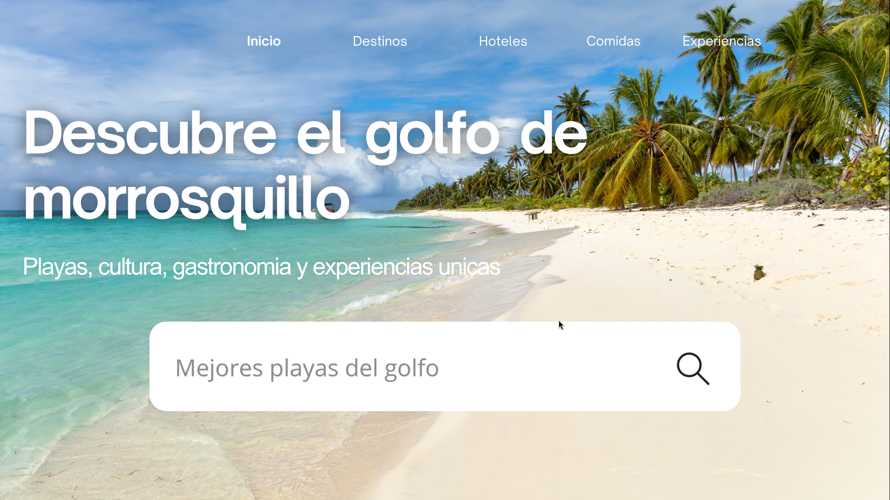

#### Destinos

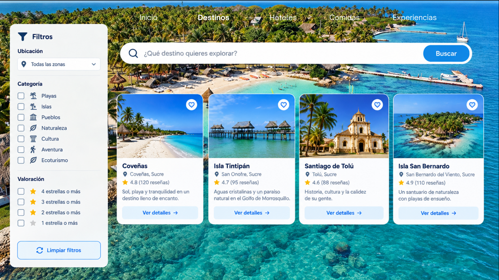

#### Detalle del destino

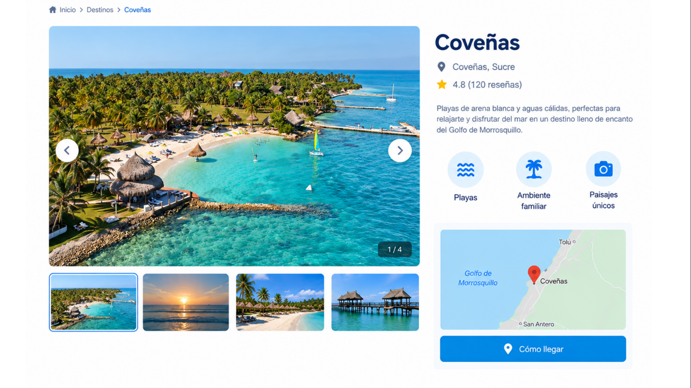

#### Hoteles y alojamientos

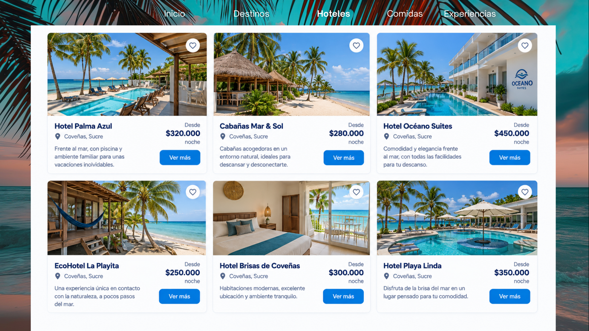

#### Gastronomía

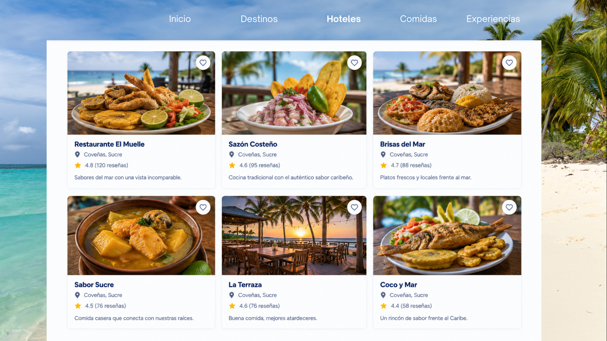

#### Experiencias

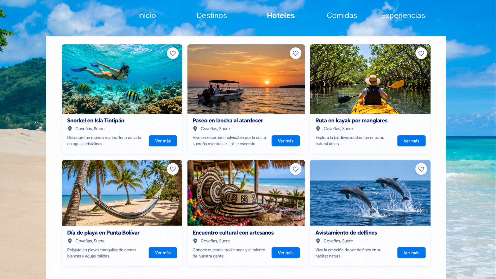

#### Eventos

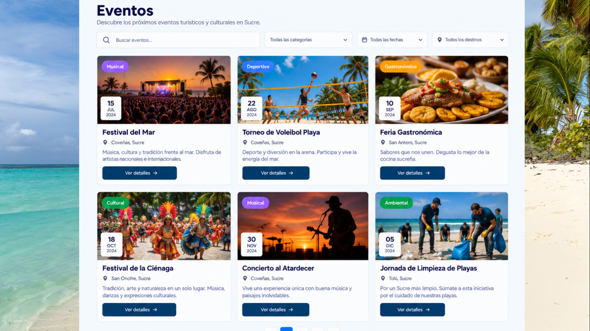

### 1.6.2 Interfaces para el administrador

#### Gestión de destinos

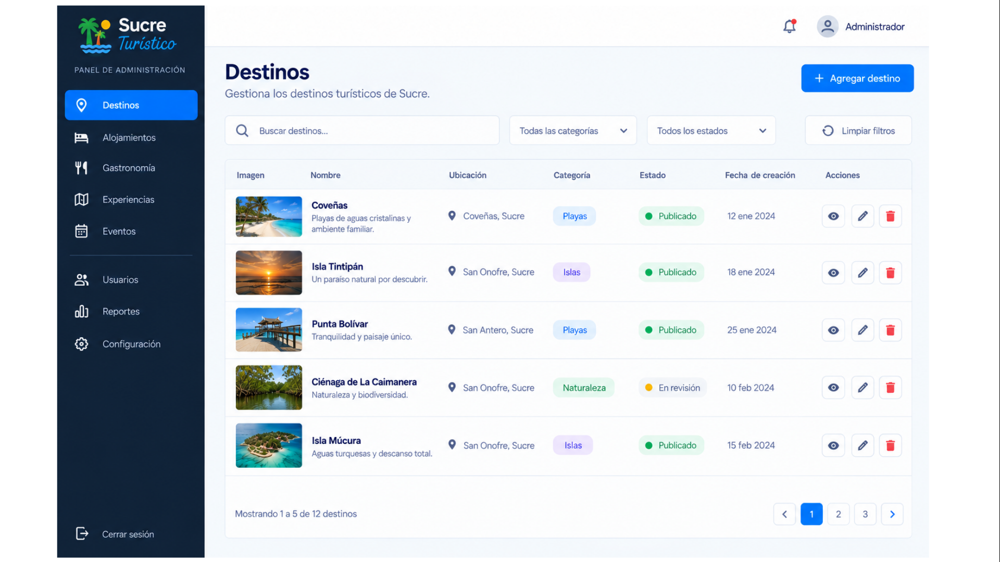

#### Gestión de alojamientos

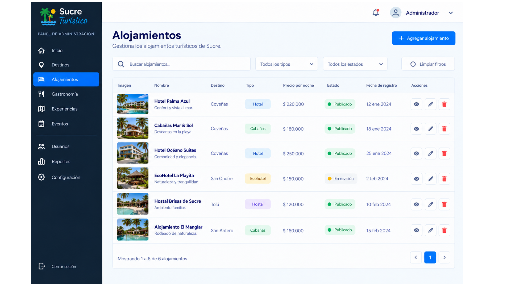

#### Gestión de gastronomía

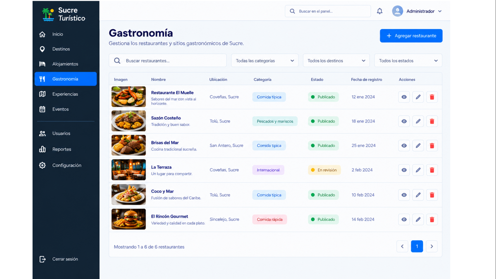

#### Gestión de experiencias

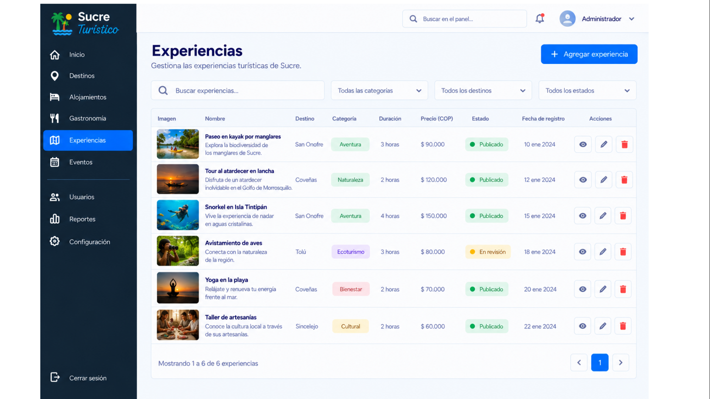

#### Gestión de eventos

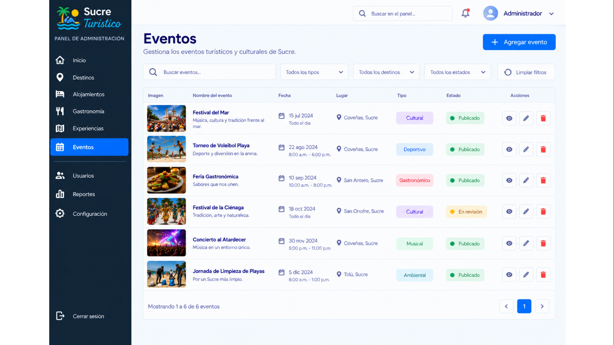

---

## 1.7 Casos de uso

Los casos de uso representan las principales interacciones entre los usuarios y la plataforma **Sucre Turístico**, identificando las funcionalidades disponibles para el turista o visitante y el administrador.

### 1.7.1 Actores

#### Turista / Visitante

El turista o visitante utiliza la plataforma para consultar información relacionada con la oferta turística del Golfo de Morrosquillo.

#### Administrador

El administrador utiliza la plataforma para gestionar y mantener actualizada la información turística registrada en el sistema.

### 1.7.2 Casos de uso del Turista / Visitante

| Caso de uso            | Descripción                                                                        |
| ---------------------- | ---------------------------------------------------------------------------------- |
| Consultar destinos     | Permite consultar los destinos turísticos disponibles.                             |
| Buscar destino         | Permite realizar búsquedas de destinos turísticos.                                 |
| Consultar alojamiento  | Permite consultar información sobre los alojamientos disponibles.                  |
| Consultar restaurantes | Permite consultar información sobre restaurantes y establecimientos gastronómicos. |
| Consultar experiencias | Permite consultar las experiencias y actividades turísticas disponibles.           |
| Consultar eventos      | Permite consultar información sobre los eventos registrados.                       |
| Filtrar resultados     | Permite filtrar los resultados de acuerdo con los criterios disponibles.           |
| Ver detalles           | Permite visualizar información detallada del elemento turístico seleccionado.      |

### 1.7.3 Casos de uso del Administrador

| Caso de uso            | Descripción                                                              |
| ---------------------- | ------------------------------------------------------------------------ |
| Iniciar sesión         | Permite al administrador acceder al sistema de gestión.                  |
| Gestionar destinos     | Permite registrar, consultar, actualizar y eliminar destinos turísticos. |
| Gestionar alojamientos | Permite administrar la información de los alojamientos registrados.      |
| Gestionar restaurantes | Permite administrar la información de los restaurantes registrados.      |
| Gestionar experiencias | Permite administrar las experiencias turísticas registradas.             |
| Gestionar eventos      | Permite administrar la información de los eventos registrados.           |
| Gestionar categorías   | Permite administrar las categorías utilizadas dentro de la plataforma.   |

### 1.7.4 Diagrama general de casos de uso

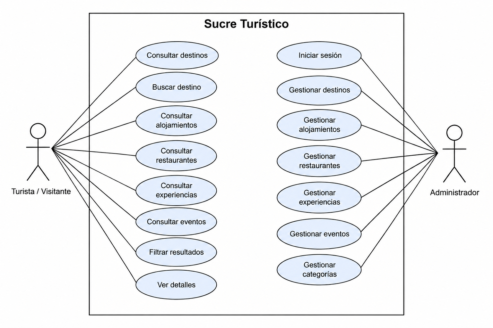

---

## 1.8 Arquitectura del sistema

La arquitectura de **Sucre Turístico** está basada en un enfoque de microservicios, permitiendo separar las diferentes funcionalidades del sistema en componentes independientes y facilitar su organización, mantenimiento y escalabilidad.

### 1.8.1 Componentes de la arquitectura

La plataforma está conformada por los siguientes componentes:

- **Usuario:** interactúa con la plataforma mediante la interfaz web.
- **Frontend:** desarrollado con React, proporciona la interfaz de interacción para los usuarios.
- **API Gateway:** desarrollado con Express, funciona como punto de entrada para las solicitudes provenientes del Frontend y permite comunicarlas con los diferentes microservicios.
- **Microservicios:** contienen las funcionalidades independientes relacionadas con los módulos de la plataforma, como destinos, alojamientos, gastronomía, experiencias y eventos.
- **Base de datos:** permite almacenar y consultar la información gestionada por los servicios de la plataforma.

### 1.8.2 Flujo de comunicación

El flujo general de comunicación del sistema se desarrolla de la siguiente manera:

1. El usuario interactúa con la interfaz web desarrollada en React.
2. El Frontend realiza solicitudes al API Gateway mediante servicios REST.
3. El API Gateway recibe y direcciona las solicitudes hacia el microservicio correspondiente.
4. El microservicio procesa la solicitud y realiza las operaciones necesarias sobre la información.
5. El microservicio consulta o modifica los datos almacenados en la base de datos.
6. La respuesta retorna desde el microservicio hacia el API Gateway.
7. El API Gateway entrega la respuesta al Frontend.
8. El Frontend presenta la información al usuario.

### 1.8.3 Diagrama de arquitectura

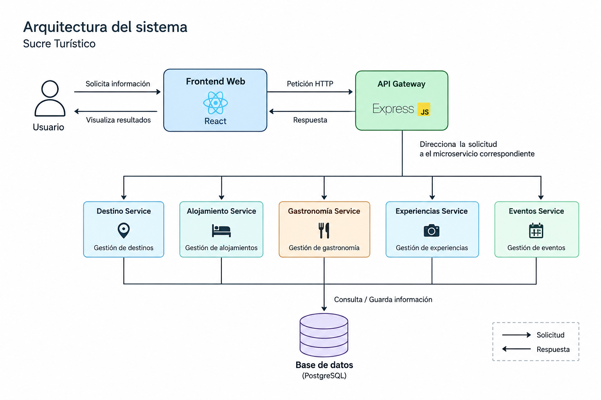

---
